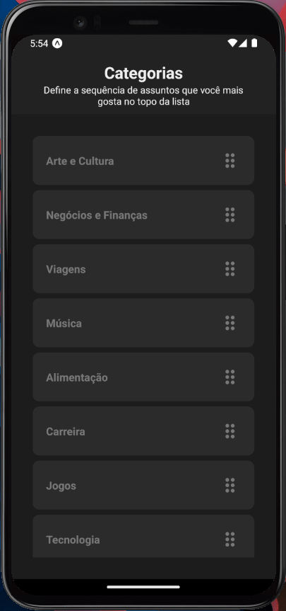

# React-Native-Draggable-List

<h2 align="center">
  A simple animated list that you can drag and order the items. Built with React Native, Expo, Reanimated and Gesture Handler.
</h2>

<p align="center">
  
  
  
  
  <a href="https://github.com/areasflavio/react-native-draggable-list/commits/master">
    
  </a>
</p>

<p align="center">
  <a href="#star-features">Features</a>&nbsp;&nbsp;|&nbsp;&nbsp;
  <a href="#keyboard-technologies">Technologies</a>&nbsp;&nbsp;|&nbsp;&nbsp;
  <a href="#computer_mouse-installation">Installation</a>
</p>

<p align="center">
  
</p>

<br/>

# :star: Features

[(Back to top)](#React-Native-Draggable-List)

Some key features are:

- Draggable function for order items
- Smooth scrolling animation

The application is built using React Native with Expo framework.
The user gesture interface is built with Reanimated and Gesture Handler.
The entire codebase is written using Typescript.

<br/>

# :keyboard: Technologies

[(Back to top)](#React-Native-Draggable-List)

This is what I used and learned with this project:

- [x] React Native
- [x] Expo
- [x] React Native Reanimated
- [x] React Native Gesture Handler
- [x] Typescript

<br/>

# :computer_mouse: Installation

[(Back to top)](#React-Native-Draggable-List)

To use this project, first you need NodeJS installed in your device,
then you can follow the commands below:

```bash
# Clone this repository
git clone https://github.com/areasflavio/react-native-draggable-list.git

# Go into the repository
cd react-native-draggable-list

# Install dependencies for the application
yarn install

# To start the development server, run the following command
yarn start

# You start the emulator following the terminal instructions or:
yarn start android # for android emulator

yarn start ios # for ios emulator
```

# :man_technologist: Author

[(Back to top)](#React-Native-Draggable-List)

Build by Flávio Arêas 👋 [Get in touch!](https://www.linkedin.com/in/areasflavio/)
